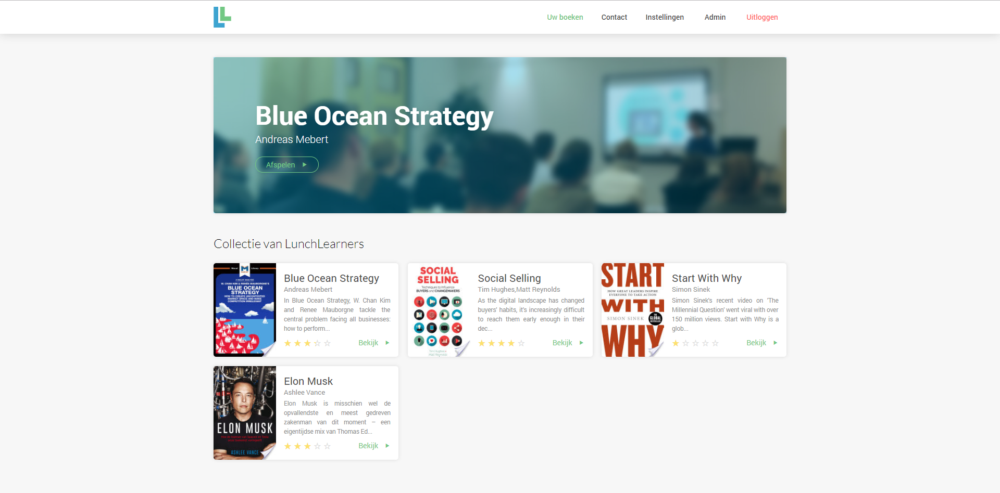
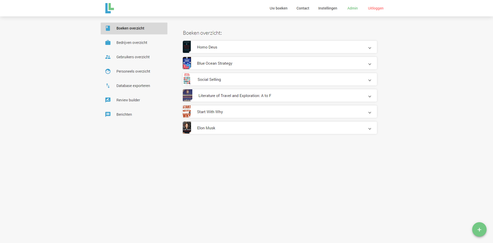

# LunchlearnersPlatform

Het Lunchlearners platform is gebouwd op Angular5 en Google Firebase 

## create component 
create component : in terminal 'ng g component my-new-component --module=app.module'
create service : in terminal 'ng g class my-new-class --module=app.module'
